# FinServ ETL Pipeline - Databricks Medallion Architecture

End-to-end streaming ETL pipeline for financial services credit card transaction processing. Built on Databricks Lakehouse with Unity Catalog governance, demonstrating production patterns for FinServ regulatory compliance.

## Architecture

```mermaid
flowchart LR
    subgraph Sources["Data Sources"]
        CN[Card Networks]
        POS[POS Terminals]
        MW[Mobile Wallets]
    end

    subgraph Bronze["Bronze Layer"]
        direction TB
        B_TABLE[("dbx_weg.bronze\n.transactions\n45,244 rows")]
        B_NOTES["ACID / exactly-once\nPartitioned by date\nImmutable audit trail\nTime travel enabled"]
    end

    subgraph Silver["Silver Layer"]
        direction TB
        S_TABLE[("dbx_weg.silver\n.transactions\n45,244 rows")]
        S_NOTES["PII masked (PCI-DSS)\nDQ validation\nRisk enrichment\nMERGE INTO upserts"]
        Q{"Quarantine"}
    end

    subgraph Gold["Gold Layer"]
        direction TB
        G1[("cardholder_features")]
        G2[("merchant_risk_summary")]
        G3[("hourly_volume_stats")]
        G_NOTES["22+ ML features\nZ-ORDER optimized"]
    end

    subgraph MLflow["MLflow"]
        direction TB
        M_TRAIN["GradientBoosting\nRandomForest"]
        M_TRACK["Experiment Tracking\nModel Comparison"]
        M_PRED[("fraud_predictions")]
    end

    subgraph Serving["Serving Layer"]
        PBI[Power BI / Genie AI]
        DBSQL[DBSQL Dashboards]
        FRAUD[Fraud Predictions]
    end

    Sources --> Bronze
    Bronze --> Silver
    Silver --> Gold
    Silver -.-> Q
    Gold --> MLflow
    MLflow --> Serving
    Gold --> Serving

    style Bronze fill:#D4A574,stroke:#8B6914,color:#5C3D12
    style Silver fill:#B8C4D0,stroke:#5A6A7A,color:#2C3E50
    style Gold fill:#F5D76E,stroke:#B8860B,color:#6B4C00
    style MLflow fill:#AEC6CF,stroke:#2C5F7C,color:#1A3A4A
    style Q fill:#FFE0E0,stroke:#C0392B,color:#C0392B
```



> **Editable diagram:** Open [`docs/finserv-etl-pipeline.excalidraw`](docs/finserv-etl-pipeline.excalidraw) in [excalidraw.com](https://excalidraw.com) for a fully editable version with more detail.

## Pipeline Overview

| Phase | Notebook | Layer | Key Concepts |
|-------|----------|-------|-------------|
| 1 | `01_Bronze_FinServ_Streaming.py` | Bronze | Structured Streaming, `rate` source, Delta Lake, checkpointing, `availableNow` trigger |
| 2 | `02_Silver_Cleanse_PII.py` | Silver | `foreachBatch`, MERGE INTO, PII masking (PCI-DSS), data quality + quarantine |
| 3 | `03_Gold_Aggregates_Features.py` | Gold | Business aggregates, 22+ ML features, Z-ORDER optimization |
| 4 | `04_MLflow_Fraud_Detection.py` | ML | MLflow tracking, model comparison, registry, batch inference |

## Pipeline Results

```
=============================================
 PIPELINE SUMMARY - All Tables
=============================================
  bronze.transactions                 45,244 rows
  silver.transactions                 45,244 rows
  gold.cardholder_features                10 rows
  gold.merchant_risk_summary             500 rows
  gold.hourly_volume_stats                20 rows
  gold.fraud_predictions                  10 rows
=============================================
```

## Key FinServ Patterns Demonstrated

### Data Governance (Unity Catalog)
- **PII Masking:** Card numbers masked (`****-****-****-1234`), cardholder names SHA-256 tokenized
- **Column-level security:** Raw PII dropped in Silver, only masked/tokenized versions downstream
- **Audit trail:** Bronze layer is immutable, time-travel enabled for regulatory retention (5-7 years)
- **Data quality:** Validation rules with quarantine table for failed records

### Streaming Architecture
- **Exactly-once semantics:** Checkpoint-based delivery guarantee via UC Volumes
- **foreachBatch:** Bridge between streaming latency and batch-quality transforms (MERGE INTO)
- **availableNow trigger:** Same code runs streaming or batch -- just change the trigger mode

### ML Lifecycle (MLflow)
- **Experiment tracking:** Hyperparameters, metrics, artifacts, feature importance
- **Model comparison:** GradientBoosting vs RandomForest, side-by-side F1/AUC/precision/recall
- **Batch inference:** Nightly scoring pipeline writes predictions back to Delta Gold

## Serverless Compatibility

This pipeline runs on **Databricks Serverless Compute**. The following adaptations were required:

| Issue | Root Cause | Fix Applied |
|-------|-----------|-------------|
| `INFINITE_STREAMING_TRIGGER_NOT_SUPPORTED` | `ProcessingTime` not supported on serverless | Changed to `availableNow=True` |
| `DBFS_DISABLED` | Public DBFS root disabled on serverless | UC Volume checkpoints (`/Volumes/...`) |
| `Path must be absolute` | `DeltaTable.isDeltaTable()` broken on Spark Connect | `spark.catalog.tableExists()` |
| `y contains 1 class` | All records same fraud label with small dataset | Median-split risk-based label fallback |
| `PERMISSION_DENIED` on model registry | UC catalog permissions in serverless Jobs API | Graceful fallback to run-based model loading |
| `NameError: name 'F' not defined` | Missing PySpark import in MLflow notebook | Added `from pyspark.sql import functions as F` |

## Prerequisites

- Databricks workspace (Azure, AWS, or GCP)
- Unity Catalog enabled with a catalog (e.g., `dbx_weg`) and schemas: `bronze`, `silver`, `gold`
- UC Volume for checkpoints: `dbx_weg.bronze.checkpoints`
- Serverless compute or a cluster with Delta Lake and MLflow

## Quick Start

1. Create the Unity Catalog infrastructure:
   ```sql
   CREATE CATALOG IF NOT EXISTS dbx_weg;
   CREATE SCHEMA IF NOT EXISTS dbx_weg.bronze;
   CREATE SCHEMA IF NOT EXISTS dbx_weg.silver;
   CREATE SCHEMA IF NOT EXISTS dbx_weg.gold;
   CREATE VOLUME IF NOT EXISTS dbx_weg.bronze.checkpoints;
   ```

2. Import the 4 notebooks into your Databricks workspace

3. Run them in order: `01` -> `02` -> `03` -> `04`

## SA Talking Points

| Concept | Value Statement |
|---------|----------------|
| **Medallion Architecture** | "Bronze/Silver/Gold gives you governance at each layer -- raw audit trail, cleansed single source of truth, and business-ready aggregates" |
| **Structured Streaming** | "Same API for real-time and batch -- no separate streaming infrastructure" |
| **Delta Lake ACID** | "Warehouse reliability at data lake economics -- query while writing, time travel for audit" |
| **Unity Catalog** | "Centralized governance: lineage, RBAC, column masks, and audit -- regulators love this" |
| **MLflow** | "Complete ML lifecycle on one platform -- no separate ML infra, no integration tax" |
| **Serverless** | "Zero infrastructure management -- just write code and run. Pay only for what you use" |

## License

MIT
